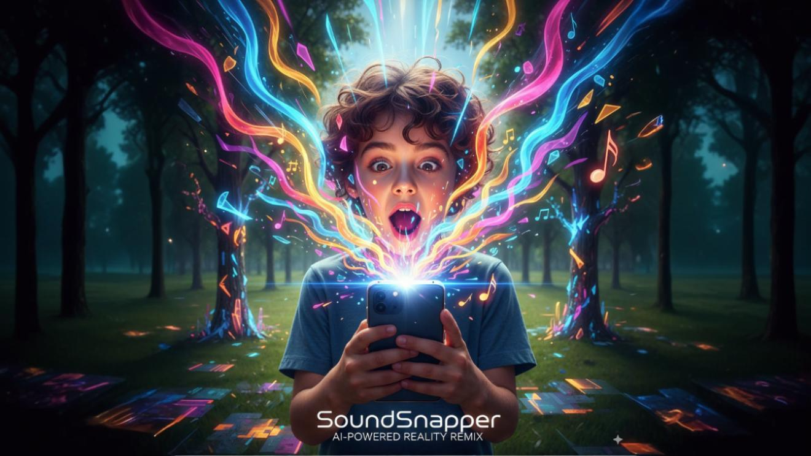

# 🎵 SoundSnapper: AI-Powered Reality Remix

> Transform your camera captures into immersive audio-visual experiences using cutting-edge AI

[](https://www.kaggle.com/competitions/banana/)  
[](https://ai.google.dev/)  
[](https://fal.ai/)  
[](https://elevenlabs.io/)



---

## ❓ Problem

Creating engaging audio-visual content usually requires **expensive tools and editing skills**.  
Most people can't instantly turn real-world objects into creative, shareable moments.

---

## 💡 Solution

**SoundSnapper** makes it **one-tap simple**:  
📷 Snap a photo → 🧠 Gemini analyzes the scene → 🎨 Fal transforms it into art → 🎵 ElevenLabs generates sound → ready to share.  

A seamless remix of **reality into AI-powered experiences**.

---

## 🌟 Key Features

- 📸 Real-time Camera Capture with intuitive mobile UI  
- 🤖 Scene Analysis with Gemini 2.5 Flash (image preview + semantic understanding)  
- 🎨 Artistic Transformations (Anime, Cyberpunk, Watercolor, etc.) via Fal AI  
- 🎵 Immersive Audio Generation with ElevenLabs (ambient loops + effects)  
- 🔊 Interactive Controls – adjust sound levels, zoom images  
- 📱 Responsive Design optimized for mobile and desktop  
- ⚡ Instant Demo – no setup needed  

---

## 🎯 Potential Audiences

- **Creators / TikTokers** – Turn everyday objects into audio-visual "mini-stories."  
- **Educators / Kids Apps** – Snap objects and discover *what they sound like* in playful, imaginative ways.  
- **Musicians / Sound Designers** – Use snaps as quick inspiration for visual → sound moodboards.  
- **Brands & Marketers** – Create interactive activations (e.g., scan a product and generate a branded soundscape).  

---

## 🚀 Example Use Cases

- 🎬 TikTok Trend Creation – Snap a coffee mug → instant surreal remix with matching audio.  
- 🎓 Classroom Activity – Kids explore the soundscapes of objects around them.  
- 🎶 Music Inspiration – Producers capture random items → spark ambient textures or loops.  
- 🛍 Brand Activation – A snack brand launches a campaign where scanning the pack generates a playful soundscape.  

---

## 🎥 Demo

🌐 [Try SoundSnapper Live (No API Required)](https://soundsnapper.vercel.app/)  

🎬 **Watch the Demo Video**  
[](https://youtu.be/MwVpIdp3tdI)

---

## 🔮 Future Plans

- 📱 Export audio + image as vertical short videos for TikTok/Reels  
- 🎭 Add style packs (Cyberpunk, Minimalist, Anime, etc.)  
- 🗂 Local gallery of recent snaps  
- 🌍 Community sharing & remixing feed  
- 🛡 Privacy-first: ephemeral image processing, no retention  

---

## 🛠 Technical Stack

- **Frontend**: React 19 + TypeScript + Vite  
- **AI Vision**: Google Gemini 2.5 Flash (image analysis)  
- **Image Transform**: Fal AI (`gemini-25-flash-image/edit`)  
- **Audio**: ElevenLabs (TTS + generative sound)  
- **Styling**: Custom CSS with Glassmorphism design  
- **Hosting**: Vercel (client) + serverless proxy endpoints  

---

## 🔧 Setup & Installation

### Prerequisites
- Node.js 18+  
- API Keys for:
  - [Google Gemini API](https://ai.google.dev/)  
  - [Fal AI](https://fal.ai/)  
  - [ElevenLabs](https://elevenlabs.io/)  

### Installation

1. Clone the repository
   ```bash
   git clone https://github.com/bilsimaging/soundsnapper.git
   cd soundsnapper
   ```

2. Install dependencies
   ```bash
   npm install
   ```

3. Setup environment variables
   ```bash
   cp .env.example .env.local
   ```
   
   Add your API keys to `.env.local`:
   ```env
   GEMINI_API_KEY=your_gemini_api_key_here
   ELEVENLABS_API_KEY=your_elevenlabs_api_key_here
   FAL_API_KEY=your_fal_api_key_here
   ```
   
   ⚠️ Important: Do not expose API keys in the client.
   Use serverless functions (e.g., Vercel/Netlify) to securely proxy Gemini, Fal, and ElevenLabs calls.

4. Start the dev server
   ```bash
   npm run dev
   ```

5. Open your browser → [http://localhost:5173](http://localhost:5173)

---

## 🎮 Usage

1. Allow camera permissions
2. Snap a photo
3. Wait for AI analysis & audio generation
4. Pick a transformation style
5. Apply transform & enjoy
6. Adjust volume / zoom preview
7. Share your remix

---

## 🏆 Competition Entry

This project was created for the Google Nano Banana Hackathon 2025 🍌

### 🔑 Judging Criteria Alignment

* **✨ Innovation & "Wow" Factor (40%)**
  SoundSnapper introduces a new kind of creative pipeline: capture any real-world object → Gemini 2.5 Flash analyzes the scene → Fal AI reimagines it visually → ElevenLabs generates a perfectly matched soundscape.
  This instant sight-to-sound remix delivers a magical experience that wasn't possible before — blending multiple AI modalities into one seamless interaction.

* **⚙️ Technical Execution (30%)**
  Built with React 19 + Vite + TypeScript, optimized for mobile and desktop, with serverless proxies to keep API keys secure.

* **🌍 Potential Impact (20%)**
  Accessible to creators, educators, musicians, and brands — turning everyday moments into immersive, shareable audio-visual stories.

* **🎥 Presentation & Demo (10%)**
  Live demo + demo video highlight the experience clearly and engagingly for judges.

---

## 🤝 Contributing

This is a hackathon project, but feel free to:

* Report bugs
* Suggest improvements
* ⭐ Star the repo if you like it!

---

## 📄 License

MIT License 

Copyright (c) 2025 Bilsimaging

---

## 🙏 Acknowledgments

* Google for Gemini 2.5 Flash
* Fal for image transformation APIs
* ElevenLabs for generative audio
* Nano Banana Hackathon organizers for the opportunity

---

**Made with ❤️ by Bilsimaging for the Nano Banana Hackathon 2025** 🍌
